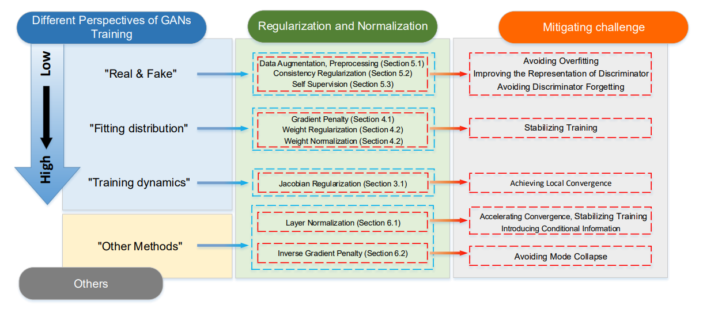

# A Systematic Survey of Regularization and Normalization in GANs



A Survey and Taxonomy of the Regularization and Normalization in GANs. Please refer to the details in recent review paper [***A Systematic Survey of Regularization and Normalization in GANs.*** ](https://arxiv.org/abs/2008.08930v5)  Ziqiang Li, Xintian Wu, Muhammad Usman, Rentuo Tao, Pengfei Xia, Huanhuan Chen, and Bin Li.

If you find this survey is useful in your research, please consider citing:

```
@article{li2020regularization,
  title={Regularization and Normalization For Generative Adversarial Networks: A Survey},
  author={Li, Ziqiang and Tao, Rentuo and Xia, Pengfei and Chen, Huanhuan and Li, Bin},
  journal={arXiv preprint arXiv:2008.08930},
  year={2020}
}
```

A table of Regularization and Normalization in Generative adversarial Networks (GANs). This page will be ****periodically**** updated to include recent works. Please contact us if your work is not in the list. Let us know if your recent work is not in the list, we will be happy to include it!

## List of Regularization and Normalization in GANs

<font color='red'> The most important studies will be highlighted in red. </font >

#### Perspective of "Real & Fake" in GANs
| Year        | Title           | Type        | Venue    | Link        |  Code      |
|-------|--------|--------|--------|-----------|---------------|
|2021|**Are High-Frequency Components Beneficial for Training of Generative Adversarial Networks**| Data Preprocessing | arXiv| [Link](https://arxiv.org/abs/2103.11093v1)| [Code](https://github.com/iceli1007/HFC-and-HFF)|
|2020|**<font color='red'>Training generative adversarial networks with limited data</font >**| Data Augmentation | NeurIPS| [Link](https://arxiv.org/pdf/2006.06676)| [Code](https://github.com/NVlabs/stylegan2-ada)|
|2020|**On Data Augmentation for GAN Training**| Data Augmentation | TIP| [Link](https://arxiv.org/pdf/2006.05338)| [Code](https://github.com/sutd-visual-computing-group/dag-gans)|
|2020|**Differentiable augmentation for data-efficient gan training**| Data Augmentation | NeurIPS| [Link](https://arxiv.org/pdf/2006.10738)| [Code](https://github.com/mit-han-lab/data-efficient-gans)|
|2020|**Image Augmentations for GAN Training**| Data Augmentation | NeurIPS| [Link](https://arxiv.org/pdf/2006.02595)| [Code](https://github.com/eldadoh/Image-Augmentations-for-GAN-Training)|
|2021| **Manifold-preserved GANs**| Image Consistency Regularization  | ArXiv| [Link](https://arxiv.org/abs/2109.08955)
|2021| **SSD-GAN: Measuring the Realness in the Spatial and Spectral Domains**| Image Consistency Regularization  | AAAI| [Link](https://arxiv.org/pdf/2012.05535.pdf)| [Code](https://github.com/cyq373/SSD-GAN)|
|2020| **Watch your Up-Convolution: CNN Based Generative Deep Neural Networks are Failing to Reproduce Spectral Distributions**| Image Consistency Regularization  | CVPR| [Link](https://arxiv.org/pdf/2003.01826.pdf)| [Code](https://github.com/cc-hpc-itwm/UpConv)|
|2017| **Mcgan: Mean and covariance feature matching gan**| Image Consistency Regularization  | ICML| [Link](https://arxiv.org/pdf/1702.08398.pdf)| 
|2016| **Improved techniques for training gans**| Image Consistency Regularization  | NeurIPS| [Link](https://proceedings.neurips.cc/paper/2016/file/8a3363abe792db2d8761d6403605aeb7-Paper.pdf)| [Code](https://github.com/openai/improved-gan)|
|2021| **Improved Consistency Regularization for GANs**| Network Consistency Regularization  | AAAI| [Link](https://arxiv.org/pdf/2002.04724.pdf)|
|2020| **<font color='red'>Consistency Regularization for Generative Adversarial Networks</font >**| Network Consistency Regularization  | ICLR| [Link](https://arxiv.org/pdf/1910.12027.pdf)|
|2020| **Augmented Cyclic Consistency Regularization for Unpaired Image-to-Image Translation**| Network Consistency Regularization  | ICPR| [Link](https://arxiv.org/pdf/2003.00187.pdf)|  
|2021| **LT-GAN: Self-Supervised GAN with Latent Transformation Detection**| Predictive Self-Supervised | WACV| [Link](https://arxiv.org/pdf/2010.09893.pdf)|
|2020| **FX-GAN: Self-Supervised GAN Learning via Feature Exchange**| Predictive Self-Supervised | WACV| [Link](https://openaccess.thecvf.com/content_WACV_2020/papers/Huang_FX-GAN_Self-Supervised_GAN_Learning_via_Feature_Exchange_WACV_2020_paper.pdf)|
|2020| **DeshuffleGAN: A Self-Supervised GAN to Improve Structure Learning**| Predictive Self-Supervised | ICIP| [Link](https://arxiv.org/pdf/2006.08694.pdf)| [Code](https://github.com/gulcinbaykal/DeshuffleGAN)|
|2019| **Self-supervised GAN: Analysis and Improvement with Multi-class Minimax Game**| Predictive Self-Supervised | NeurIPS| [Link](https://arxiv.org/abs/1911.06997)| [Code](https://github.com/tntrung/msgan)|
|2019| **<font color='red'>Self-supervised gans via auxiliary rotation loss</font>**| Predictive Self-Supervised | CVPR| [Link](https://arxiv.org/abs/1811.11212)| [Code](https://github.com/google/compare_gan)|
|2021| **<font color='red'>Training GANs with Stronger Augmentations via Contrastive Discriminator</font>**| Contrastive Self-Supervised | ICLR| [Link](https://arxiv.org/pdf/2103.09742.pdf)| [Code](https://github.com/jh-jeong/ContraD)|
|2021| **InfoMax-GAN: Improved Adversarial Image Generation via Information Maximization and Contrastive Learning**| Contrastive Self-Supervised | WACV| [Link](https://arxiv.org/pdf/2007.04589.pdf)| [Code](https://github.com/kwotsin/mimicry)|
|2021| **<font color='red'>Data-Efficient Instance Generation from Instance Discrimination</font>**| Contrastive Self-Supervised | NeurIPS| [Link](https://arxiv.org/pdf/2106.04566.pdf)| [Code](https://github.com/genforce/insgen)|


#### Perspective of "Fitting distribution" in GANs
| Year        | Title           | Type   |Lipschitz continuity     | Venue    | Link        |  Code      |
|-------|--------|--------|--------|-----------|---------------|---------|
|2021| **Towards Generalized Implementation of Wasserstein Distance in GANs**| Gradient Penalty | $\|D_{\theta}\|_{Lip}\leq 1$|AAAI| [Link](https://arxiv.org/abs/2012.03420)| [Code](https://github.com/MinkaiXu/SobolevWassersteinGAN)|
|2020| **ADVERSARIAL LIPSCHITZ REGULARIZATION**| Gradient Penalty | $\|D_{\theta}\|_{ALP-Lip}\rightarrow1$|ICLR| [Link](https://openreview.net/forum?id=Bke_DertPB)| [Code](https://github.com/dterjek/adversarial_lipschitz_regularization)|
|2019| **Towards Efficient and Unbiased Implementation of Lipschitz Continuity in GANs**| Gradient Penalty | $\|D_{\theta}\|_{Lip}\rightarrow1$|IJCAI| [Link](https://arxiv.org/abs/1904.01184)| [Code](https://github.com/ZhimingZhou/AdaShift-LGANs-MaxGP-refactored)|
|2018| **Banach Wasserstein GAN**| Gradient Penalty | $\|D_{\theta}\|_{Lip}\rightarrow1$|NeurIPS| [Link](https://arxiv.org/abs/1806.06621)| [Code](https://github.com/adler-j/bwgan)|
|2017| **<font color='red'>Improved Training of Wasserstein GANs</font>**| Gradient Penalty | $\|D_{\theta}\|_{Lip}\rightarrow1$|NeurIPS| [Link](https://arxiv.org/pdf/1704.00028.pdf)| [Code](https://github.com/igul222/improved_wgan_training)|
|2017| **On Convergence and Stability of GANs**| Gradient Penalty | $\|D_{\theta}\|_{Lip}\rightarrow1$|arXiv| [Link](https://arxiv.org/pdf/1705.07215.pdf)| [Code](https://github.com/kodalinaveen3/DRAGAN)|
|2018| **On the regularization of Wasserstein GANs**| Gradient Penalty | $\|D_{\theta}\|_{Lip}\leq 1$|ICLR| [Link](https://arxiv.org/pdf/1709.08894.pdf)| [Code](https://github.com/lukovnikov/improved_wgan_training)|
|2020| **Direct Adversarial Training: An Adaptive Method to Penalize Lipschitz Continuity of the Discriminator**| Gradient Penalty | $\|D_{\theta}\|_{Lip} \rightarrow0$|arXiv| [Link](https://arxiv.org/pdf/2008.09041.pdf)| [Code](https://github.com/iceli1007/DAT-GAN)|
|2019| **Improving Generalization and Stability of Generative Adversarial Networks**| Gradient Penalty | $\|D_{\theta}\|_{Lip} \rightarrow0$|ICLR| [Link](https://arxiv.org/pdf/1902.03984.pdf)| [Code](https://github.com/htt210/GeneralizationAndStabilityInGANs)
|2019| **Lipschitz Generative Adversarial Nets**| Gradient Penalty | $\|D_{\theta}\|_{Lip} \rightarrow0$|ICML| [Link](https://arxiv.org/pdf/1902.05687.pdf)| [Code](https://github.com/ZhimingZhou/AdaShift-LGANs-MaxGP-refactored)
|2018| **<font color='red'>Which Training Methods for GANs do actually Converge?</font>**| Gradient Penalty | $\|D_{\theta}\|_{Lip} \rightarrow0$|ICML| [Link](http://proceedings.mlr.press/v80/mescheder18a)| [Code](https://github.com/LMescheder/GAN_stability)|
|2018| **Wasserstein Divergence for GANs**| Gradient Penalty | $\|D_{\theta}\|_{Lip} \rightarrow0$|ECCV| [Link](https://arxiv.org/pdf/1712.01026.pdf)| [Code](https://github.com/Lornatang/WassersteinGAN_DIV-PyTorch)|
|2018| **A Wasserstein GAN model with the total variational regularization**| Gradient Penalty | $\|D_{\theta}\|_{Lip} \rightarrow0$|arXiv| [Link](https://arxiv.org/pdf/1812.00810.pdf)| 
|2018| **GAN-QP: A Novel GAN Framework without Gradient Vanishing and Lipschitz Constraint**| Gradient Penalty | $\|D_{\theta}\|_{Lip} \rightarrow0$|arXiv| [Link](https://arxiv.org/pdf/1811.07296.pdf)| [Code](https://github.com/bojone/gan-qp)
|2020| **Spectral bounding: Strictly satisfying the 1-Lipschitz property for generative adversarial networks**| Weight Normalization | $\|D_{\theta}\|_{Lip} \leq 1$|PR| [Link](https://www.sciencedirect.com/science/article/pii/S0031320319304790)| 
|2019| **Large scale gan training for high fidelity natural image synthesis**| Weight Normalization | |ICLR| [Link](https://arxiv.org/abs/1809.11096)| [Code](https://tfhub.dev/s?q=biggan)
|2019| **Spectral Regularization for Combating Mode Collapse in GANs**| Weight Normalization | $\|D_{\theta}\|_{Lip} \rightarrow 1$|ICCV| [Link](https://arxiv.org/pdf/1908.10999.pdf)| [Code](https://github.com/max-liu-112/SRGANs)
|2018| **<font color='red'>Spectral normalization for generative adversarial networks</font>**| Weight Normalization | $\|D_{\theta}\|_{Lip} \rightarrow 1$|ICLR| [Link](https://arxiv.org/abs/1802.05957)| [Code](https://github.com/pfnet-research/sngan_projection)

#### Perspective of "Training Dynamics" in GANs
| Year        | Title           | Type       | Venue    | Link        |  Code      |
|-------|--------|--------|--------|-----------|---------------|
|2019| **Towards a Better Understanding and Regularization of GAN Training Dynamics**| Jacobian Regularization|UAI| [Link](https://arxiv.org/pdf/1806.09235.pdf)|[Code](https://github.com/weilinie/JARE)
|2018| **<font color='red'>Which Training Methods for GANs do actually Converge?</font>**| Gradient Penalty |ICML| [Link](http://proceedings.mlr.press/v80/mescheder18a)| [Code](https://github.com/LMescheder/GAN_stability)|
|2017| **The numerics of gans**| Jacobian regularization|NeurIPS| [Link](https://arxiv.org/pdf/1705.10461.pdf)| [Code](https://github.com/LMescheder/TheNumericsOfGANs)|
|2017| **Gradient descent GAN optimization is locally stable**| Jacobian regularization|NeurIPS| [Link](https://arxiv.org/pdf/1706.04156.pdf)| [Code](https://github.com/locuslab/gradient_regularized_gan)|
#### Others
| Year        | Title           | Type       | Venue    | Link        |  Code      |
|-------|--------|--------|--------|-----------|---------------|
|2017| **On the effects of batch and weight normalization in generative adversarial networks**| Unconditional Layer Normalization|ArXiv| [Link](https://arxiv.org/pdf/1704.03971.pdf)|[Code](https://github.com/stormraiser/GAN-weight-norm)
|2020| **Attentive Normalization for Conditional Image Generation**| conditional Layer Normalization|CVPR| [Link](https://arxiv.org/pdf/2004.03828.pdf)|[Code](https://github.com/dvlab-research/AttenNorm)
|2019| **<font color='red'>A style-based generator architecture for generative adversarial networks</font>**| conditional Layer Normalization|CVPR| [Link](https://arxiv.org/pdf/1812.04948.pdf)|[Code](https://github.com/NVlabs/stylegan)
|2019| **Semantic Image Synthesis with Spatially-Adaptive Normalization**| conditional Layer Normalization|CVPR| [Link](https://arxiv.org/pdf/1903.07291.pdf)|[Code](https://github.com/NVlabs/SPADE)
|2018| **<font color='red'>cGANs with projection discriminator</font>**| conditional Layer Normalization|ICLR| [Link](https://arxiv.org/abs/1802.05637)|[Code](https://github.com/pfnet-research/sngan_projection)
|2019| **Diversity-Sensitive Conditional GANs**|  Inverse Gradient Penalty|ICLR| [Link](https://arxiv.org/abs/1901.09024)|[Code](https://github.com/maga33/DSGAN)
|2018| **Is Generator Conditioning Causally Related to GAN Performance?**|  Inverse Gradient Penalty|ICML| [Link](https://arxiv.org/pdf/1802.08768.pdf)|[Code](https://github.com/MCDM2018/Implementations)
|2021| **<font color='red'>Regularizing Generative Adversarial Networks under Limited Data</font>**| Discriminator Deceleration|CVPR| [Link](https://arxiv.org/pdf/2104.03310.pdf)|[Code](https://github.com/google/lecam-gan)

## Authors

This page is managed and maintained by:
* Ziqiang Li <iceli@mail.ustc.edu.cn>
* Yi Wu <wuyi2021@mail.ustc.edu.cn>
* Hong Sun <hsun777@mail.ustc.edu.cn>
